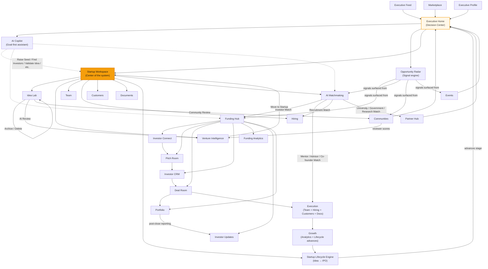

# Executive Path — Master Information Architecture

This is the top-level index that ties together everything already spec'd for the Executive Path: `EXECUTIVE_PATH_DESIGN_SYSTEM.md`, `STARTUP_WORKSPACE_DESIGN_SPEC.md`, `FUNDING_HUB_DESIGN_SPEC.md`, `EXECUTIVE_INTELLIGENCE_LAYER_DESIGN_SPEC.md`, `ECOSYSTEM_LAYER_DESIGN_SPEC.md`, `IDENTITY_INTELLIGENCE_LAYER_DESIGN_SPEC.md`, and `EXECUTIVE_TECHNICAL_BLUEPRINT.md`. Nothing below introduces new modules or contradicts those documents — this is the architecture-first map showing how they fit together as one system with Startup Workspace at the center, per the organizing principle in this request. Every module referenced here already has its detailed screen-by-screen spec in the sibling document named alongside it; this document does not repeat that depth.

## 1. Level-1 Information Architecture

| # | Module | Role in the system | Detailed spec |
|---|---|---|---|
| 0 | **Executive Home** | Decision center, not a menu — surfaces what needs a decision today across every module below | `EXECUTIVE_PATH_DESIGN_SYSTEM.md` §2 (built for real: `ExecutiveHome.jsx`) |
| 1 | **Startup Workspace** *(center of the system)* | The one place a founder builds their company: Overview, Idea Lab, Venture Intelligence, Team, Hiring, Customers, Documents, Startup Timeline | `STARTUP_WORKSPACE_DESIGN_SPEC.md` |
| 1a | — Idea Lab | Lives inside Startup Workspace; the idea → startup conversion pipeline | `STARTUP_WORKSPACE_DESIGN_SPEC.md` §3–8 |
| 1b | — Venture Intelligence | Lives inside Startup Workspace; the flagship analysis capability | `STARTUP_WORKSPACE_DESIGN_SPEC.md` §7, deepened below in §4 of this document |
| 2 | **Funding Hub** | Dedicated top-level module for the fundraising lifecycle: Investor Connect (Discovery+Profile), Pitch Room, Deal Room, Investor CRM, Funding Analytics, Investor Updates, Portfolio | `FUNDING_HUB_DESIGN_SPEC.md` |
| 3 | **AI Copilot** | Cross-cutting, goal-first assistant reachable from everywhere — not a module you navigate to, a layer you invoke | New behavior spec'd in §5 of this document; underlying system already real (`CopilotWidget.jsx`) |
| 4 | **AI Matchmaking** | Major top-level path: Investor/Mentor/Customer/Co-founder/Advisor/Government/Research/Recruitment/University match | `EXECUTIVE_INTELLIGENCE_LAYER_DESIGN_SPEC.md` §3, generalized per `EXECUTIVE_TECHNICAL_BLUEPRINT.md` §7 |
| 5 | **Opportunity Radar** | The Executive Home signal engine — proactive, not searched | `EXECUTIVE_PATH_DESIGN_SYSTEM.md` §2 (shipped) + `EXECUTIVE_INTELLIGENCE_LAYER_DESIGN_SPEC.md` §2 (full screen) |
| 6 | **Executive Feed** | Broad AI intelligence feed — Following, Startup News, Founder Stories, Funding, AI, Market Intelligence, Government, University Innovation, Research, Events, Hiring, Recommended | `EXECUTIVE_INTELLIGENCE_LAYER_DESIGN_SPEC.md` §1 |
| 7 | **Communities** | Ecosystem-wide, organized by Industry/Technology/Stage/Region/Audience-type | `ECOSYSTEM_LAYER_DESIGN_SPEC.md` §1 |
| 8 | **Partner Hub** | Technology/Enterprise/Channel/Manufacturing/Distribution/Universities/Government/Research Labs | `ECOSYSTEM_LAYER_DESIGN_SPEC.md` §3, `STARTUP_WORKSPACE_DESIGN_SPEC.md` §3 module 11 (reconciled — one Partner Hub, not two) |
| 9 | **Marketplace** | Beyond services: Professional Services, Technology, Growth, Compliance, Operations, Talent, Funding Support, Cloud Credits, Software, AI Agents | `ECOSYSTEM_LAYER_DESIGN_SPEC.md` §4 |
| 10 | **Events** | Pitch Day, Demo Day, Hackathon, Investor Meet, Networking, Bootcamp, AMA, Webinars | `ECOSYSTEM_LAYER_DESIGN_SPEC.md` §2 |
| 11 | **Executive Profile** | Achievements, Companies, Patents, Investments, Media, Awards, Followers, Influence Index, Speaking, Communities | `IDENTITY_INTELLIGENCE_LAYER_DESIGN_SPEC.md` §1 (replaces broken `AuthorityProfile.jsx` in place) |
| 12 | **Brand Studio, Executive Analytics, Inbox, Notifications, Settings** | Supporting identity/operations layer around the Profile | `IDENTITY_INTELLIGENCE_LAYER_DESIGN_SPEC.md` §2–6 |
| 13 | **Startup Lifecycle Engine** | Cross-cutting state machine, not a screen — Idea → Validation → Prototype → MVP → Early Customers → Revenue → Pre-Seed → Seed → Series A → Growth → Global Expansion → IPO/Acquisition | `STARTUP_WORKSPACE_DESIGN_SPEC.md` §8 (Timeline UI) + `EXECUTIVE_TECHNICAL_BLUEPRINT.md` §6 (workflow engine) |
| 14 | **Knowledge Center** | Supporting content layer (Playbooks, Guides, Government Schemes) — not in this brief's numbered list but already spec'd and worth keeping in the IA for completeness | `ECOSYSTEM_LAYER_DESIGN_SPEC.md` §5 |

The organizing rule made explicit: **1 (Startup Workspace) is the only module every other module ultimately refers back to.** Funding Hub's rounds belong to a startup. Idea Lab lives inside Startup Workspace, not beside it. Matchmaking, Opportunity Radar, and the Feed all surface signals about a startup. Communities/Partner Hub/Marketplace/Events are where a startup finds resources and relationships. The Profile and Lifecycle Engine describe the founder and the startup's progression respectively. Nothing in this IA is a peer of Startup Workspace — everything orbits it, per the stated core principle.

## 2. Mermaid Flowchart

## 3. Level-2 Navigation Breakdown

**Executive Home** (not a nav item — the landing surface): AI Copilot entry point · Today's Focus/critical alerts · Investor Replies · Venture Intelligence Report notifications · Mentor Acceptance · Grant Deadlines · Enterprise Interest · AI Recommendations · Upcoming Events · Opportunity Radar preview · Executive Feed preview.

**Startup Workspace**: Overview · Idea Lab · Venture Intelligence · Team · Hiring · Customers · Documents · Startup Timeline. (Matches `STARTUP_WORKSPACE_DESIGN_SPEC.md` §1 nav exactly — Analytics and AI Assistant from that spec are reachable here too, folded into Overview and the global Copilot respectively per this request's emphasis on Copilot being a cross-cutting layer, not a Startup Workspace sub-tab.)

- *Idea Lab sub-flow*: Idea List → Create Idea → Upload Deck (pitch deck/demo video/prototype/financial model/research) → AI Review (automatic) → Community Review (reviewer-cycle setup + reviewer scoring, per `STARTUP_WORKSPACE_DESIGN_SPEC.md` §5–6) → Venture Intelligence Report generated → **Move to Startup** (promotes the idea into an active `startups` row, entering the Lifecycle Engine at the Validation stage) → Archive or Delete (either available at any point before promotion).
- *Venture Intelligence sub-nav*: Executive Summary · Innovation/Market/Competition/Technology/Risk Analysis · Investor Readiness · Execution Roadmap · Suggested Mentors/Investors/Incubators/Accelerators/Universities/Programs · Comparison with Similar Startups.

**Funding Hub**: Dashboard · Investor Connect (Discovery + AI Matchmaking's investor lane + Investor Profile) · Pitch Room · Deal Room · Investor CRM · Funding Analytics · Investor Updates · Portfolio · Documents (shared with Startup Workspace's Documents, scoped) · Meetings · Due Diligence.

**AI Copilot** (global, invoked from Home/Workspace/Funding Hub/anywhere — see §5 for the interaction model): Raise Seed Round · Validate Idea · Find Investors · Find Grants · Improve GTM · Generate Pitch · Schedule Mentor · Build Hiring Plan · Launch Marketing · Expand to US · Start Due Diligence.

**AI Matchmaking**: Investor Match · Mentor Match · Customer Match · Co-founder Match · Advisor Match · Government Match · Research Match · Recruitment Match · University Match — one shared card pattern (per `EXECUTIVE_INTELLIGENCE_LAYER_DESIGN_SPEC.md` §3), a type-switcher at top rather than nine separate screens.

**Opportunity Radar**: filter rail by category (Investor Views, Grant Availability, Mentor Invites, Enterprise Partnerships, Student Innovation, Accelerator Offers, Board Invitations) · urgency sort · deadline sort.

**Executive Feed**: Following · Startup News · Founder Stories · Funding · AI & Technology · Market Intelligence · Government · University Innovation · Research · Events · Hiring · Recommended — checklist-style category filters, not pill-scroll, per `EXECUTIVE_INTELLIGENCE_LAYER_DESIGN_SPEC.md` §1.

**Communities**: Discover (by Industry/Technology/Startup Stage/Region/Audience: Universities, Investors, Women Founders, Student Founders, Government, Accelerators, Incubators, Research Labs) · My Communities · Private/Invite-only.

**Partner Hub**: Technology · Enterprise · Channel · Manufacturing · Distribution · Universities · Government · Research Labs — one profile pattern per `ECOSYSTEM_LAYER_DESIGN_SPEC.md` §3.

**Marketplace**: Professional Services (Legal/Finance/Accounting/Tax/Compliance) · Technology (Software/Dev/AI Agents) · Growth (Marketing/Branding/Design/Sales) · Operations (HR/Recruitment) · Funding Support (Fundraising Consultants/Fractional CXOs) · Cloud Credits.

**Events**: Calendar/Discover by category (Pitch Day, Demo Day, Hackathon, Investor Meet, Networking, Bootcamp, AMA, Webinars) · My Events (RSVP'd/Attended) · Post-event (Recording/AI Notes/Certificate).

**Executive Profile**: Hero (Mission/Vision/Verified badge) · Founder Journey · Credentials (Achievements/Patents/Media/Awards/Speaking, unified per `IDENTITY_INTELLIGENCE_LAYER_DESIGN_SPEC.md` §1) · Startup Portfolio · Investment Portfolio · Communities · Followers/Influence Index · Recommendations.

## 4. Lifecycle Map — Idea → Funded Business

```mermaid
flowchart LR
    Idea["Idea"] --> Validation["Validation"]
    Validation --> Prototype["Prototype"]
    Prototype --> MVP["MVP"]
    MVP --> EarlyCustomers["Early Customers"]
    EarlyCustomers --> Revenue["Revenue"]
    Revenue --> PreSeed["Pre-Seed"]
    PreSeed --> Seed["Seed"]
    Seed --> SeriesA["Series A"]
    SeriesA --> Growth["Growth"]
    Growth --> GlobalExpansion["Global Expansion"]
    GlobalExpansion --> IPO["IPO / Acquisition"]

    subgraph "Owned by Idea Lab"
    Idea
    end
    subgraph "Owned by Startup Workspace + Venture Intelligence"
    Validation
    Prototype
    MVP
    end
    subgraph "Owned by Startup Workspace (Customers/Team)"
    EarlyCustomers
    Revenue
    end
    subgraph "Owned by Funding Hub"
    PreSeed
    Seed
    SeriesA
    end
    subgraph "Owned by Growth + Analytics + Partner Hub/Marketplace"
    Growth
    GlobalExpansion
    end
    subgraph "Owned by Portfolio"
    IPO
    end
```

Every transition on this map is a real, timestamped `startup_milestones` row (per `STARTUP_WORKSPACE_DESIGN_SPEC.md` §0.2/§8), not a marketing narrative — the Lifecycle Engine is the same mechanism referenced by the Journey Trail concept in `ECOSYSTEM_LAYER_DESIGN_SPEC.md` §6, generalized: idea-stage transitions are driven by the Idea Lab flow (§3 above), Pre-Seed/Seed/Series A transitions are driven by `funding_rounds` reaching Closed status in Funding Hub, and every stage change is what feeds Executive Home's decision-center surfacing and Opportunity Radar's relevance scoring — the lifecycle isn't a separate "progress bar" widget, it's the backbone every other module reads its context from.

## 5. AI Copilot as a goal-first layer (new interaction model, formalized here)

Prior specs treated the Copilot as a contextual assistant embedded per-screen. This request asks for something more specific: a goal-first entry point. Concretely, the Copilot's opening interaction — reachable from Executive Home's hero position and from a persistent affordance everywhere else — is the question "What would you like to achieve?" rather than a blank chat box. The answer routes to one of eleven defined flows (Raise Seed Round, Validate Idea, Find Investors, Find Grants, Improve GTM, Generate Pitch, Schedule Mentor, Build Hiring Plan, Launch Marketing, Expand to US, Start Due Diligence), each of which is a **guided multi-step sequence that calls into the real modules** (e.g. "Raise Seed Round" walks the founder through checking Venture Intelligence readiness → Investor Discovery → Pitch Room setup → Investor CRM, rather than the Copilot trying to do all of that inside the chat window itself). This keeps the "AI outputs are probabilistic, never authoritative for critical actions" principle intact — the Copilot orchestrates and explains, the real modules (with their real permission/data-integrity rules) execute.

## 6. Why this makes Capabilio feel like a true Founder Operating System

The test this request sets — not a feature list, not a social app, not a generic dashboard — is met by three structural decisions, not by any single screen's visual polish. First, everything genuinely orbits one center: Idea Lab isn't a sibling of Startup Workspace, it's inside it; Funding Hub's rounds, Matchmaking's investor lane, and Opportunity Radar's investor signals all resolve back to a specific startup rather than existing as independent features a founder has to mentally stitch together. Second, the Home screen is a decision center because every widget on it answers "what needs my judgment today," sourced from real events elsewhere in the system (an investor reply, a review cycle closing, a grant deadline) — never a static menu of equally-weighted icons, which is the exact anti-pattern this brief calls out. Third, the lifecycle is real and load-bearing, not decorative: a startup's stage is a genuine state derived from milestone events, and that state is what the rest of the system — Radar's relevance, the Copilot's suggested next flow, the Feed's personalization — reads from, so the platform's intelligence compounds as the founder progresses instead of resetting to generic advice at every screen. Those three properties together are what separate an operating system from a directory of tools, and they're already reflected in the five module specs and the technical blueprint this document indexes — nothing here required inventing new product surface, only making the orbit explicit.
