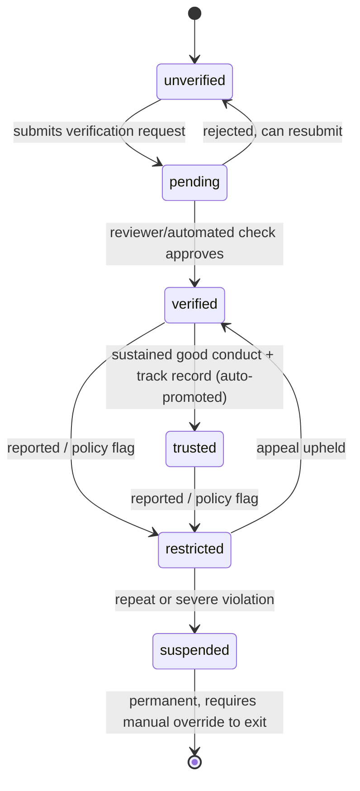
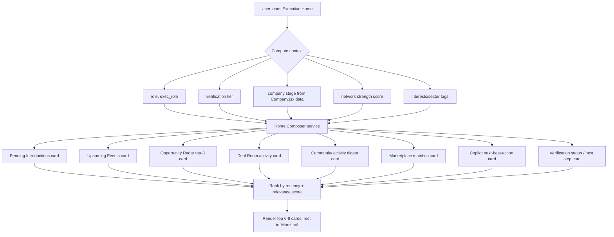
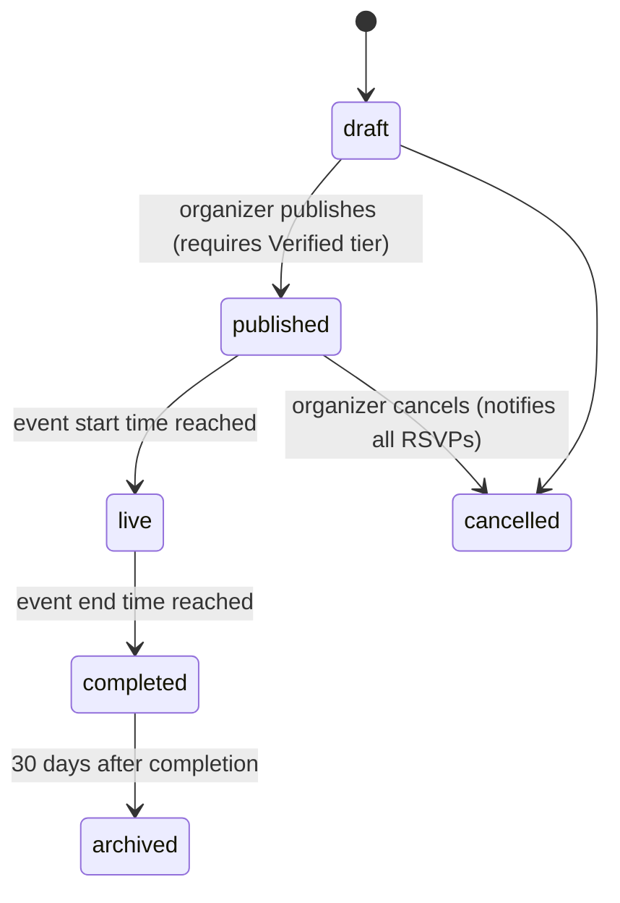
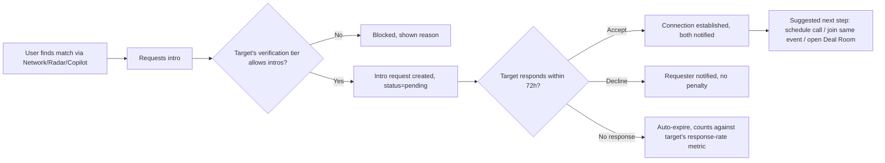
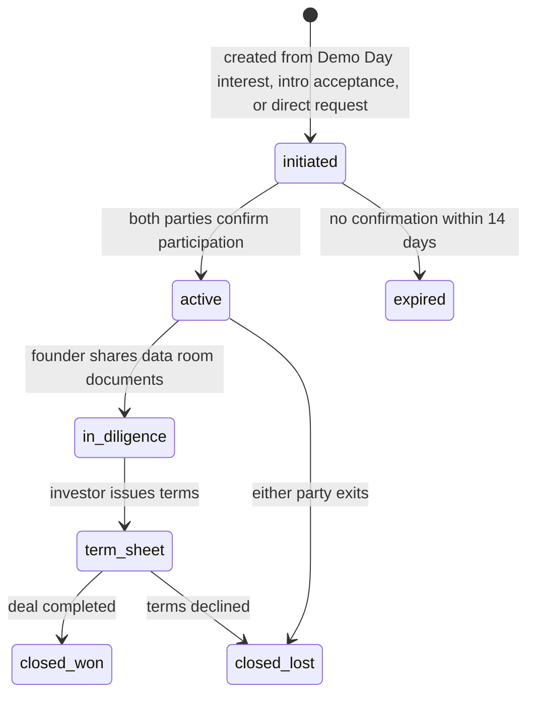

# Capabilio Executive Path — V2 Master Blueprint
**Founder Ecosystem & Execution Network — Product, Architecture, and Rollout Plan**

Status: design blueprint, not yet implemented (see §S for phased build order)
Supersedes/consolidates for planning purposes: `EXECUTIVE_PATH_DESIGN_SYSTEM.md`, `EXECUTIVE_PATH_INFORMATION_ARCHITECTURE.md`, `EXECUTIVE_TECHNICAL_BLUEPRINT.md`, `EXECUTIVE_INTELLIGENCE_LAYER_DESIGN_SPEC.md` (kept as historical reference — this doc is the authoritative one going forward for scope described here)

---

## 0. Ground truth — what already exists (read before building anything)

This blueprint is written against the live repo, not a blank slate. Confirmed by direct code audit on 2026-07-26:

**Real, live, backed by actual queries (not stubs):**
| Page | Route (`currentPage`) | Backing | State |
|---|---|---|---|
| `ExecutiveHome.jsx` | `executiveHome` | Real profile/company signals | Live |
| `ExecutiveFeed.jsx` | `executivefeed` | Real "Following" feed (Sprint 4 rebuild — no mocks) | Live |
| `ExecutiveNetwork.jsx` | `execnetwork` | Real people-graph / follows | Live |
| `ExecutiveAnalytics.jsx` | `analytics` | Real data (Sprint 6a rewired off mocks) | Live |
| `AuthorityProfile.jsx` | `authority` | Real profile + verification status | Live |
| `Company.jsx` + `CompanyInvitePage.jsx` | — | Real `company.js` routes: `/me`, `/me/link`, `/create`, `/me/visibility`, `/search`, `/:id` | Live |
| `StartupWorkspace.jsx` | — | Team/hiring/documents/customers scoping (Sprint 2–3) | Live |
| `mentorMarketplace.js` | — | Real bookings/reviews/payouts (Professional-path mentor marketplace — **different product** from the Executive marketplace this doc specifies, but its state machine is a reusable pattern, see §G) | Live |
| `verification.js` + `orgVerification.js` + `verify.js` | — | Real verification pipeline: `certificate_ocr`/`github` providers live, audit-chain integrity check, PC-7-protected trust columns (server-only writes) | Live |

**Stubs today — literally `<ExecutiveComingSoon module="X"/>`, zero backend:**
| Nav item | `currentPage` | Current state |
|---|---|---|
| Funding | `funding` | `ExecutiveComingSoon` |
| Communities | `communities` | `ExecutiveComingSoon` |
| Events | `events` | `ExecutiveComingSoon` |
| Marketplace | `marketplace` | `ExecutiveComingSoon` |
| AI Copilot | `aicopilot` | `ExecutiveComingSoon` |

**Does not exist at all today, anywhere in the repo:** Deal Rooms, Opportunity Radar (only *specified*, not built, in `EXECUTIVE_INTELLIGENCE_LAYER_DESIGN_SPEC.md` §2), tiered verification beyond the current binary-ish `verificationStatus` column, event RSVP/attendance tables, community membership/post tables, marketplace listing tables.

**Implication for this blueprint:** five of the ten requested modules (Communities, Events, Marketplace, AI Copilot, Deal Rooms) require **new backend from zero** — this is not a reskinning exercise. Home, Network, Analytics, Profile/Verification are **extend-in-place** work on real systems. Opportunity Radar is a **new cross-cutting service**, not a page — it's a recommendation feed that surfaces inside Home, Network, Communities, and Marketplace rather than living behind its own nav item (see §L for why).

---

## A. Product vision

Capabilio Executive is the **founder execution layer** of the Capabilio Career OS — the surface where founders, co-founders, mentors, investors, incubators, operators, and ecosystem service providers do the actual work of building a company: finding people, raising money, running events, closing deals, and tracking what's working.

It is explicitly **not**:
- a static "founder dashboard" of vanity metrics
- a general social feed with founders as the theme
- a startup-validation quiz tool
- a directory you browse once and forget

It **is**:
- a daily-return execution surface — every visit surfaces something actionable (an intro to accept, an event to RSVP, a deal room update, a matched investor)
- verification-gated at every trust boundary, so a mentor's "verified" badge and an investor's "verified" badge mean something specific and are enforced server-side
- built around four irreducible primitives: **people** (network), **structured spaces** (communities/events/deal rooms), **exchange** (marketplace), and **signal** (analytics/copilot/opportunity radar) — every module maps to exactly one of these, which is how we avoid the generic-feed trap.

North star metric: **% of verified Executive users who complete ≥1 real action (RSVP, intro accepted, deal room message, marketplace inquiry) in a 7-day window.** Not DAU, not session count — actions, because this is a workbench, not a feed.

---

## B. User types and roles

| Role | Primary need | Verification tier required to unlock most features |
|---|---|---|
| Founder | Co-founders, capital, mentors, customers, events | Founder-verified |
| Co-founder / early team | Same as founder, scoped to their company | Team-verified (attached to a verified company) |
| Startup mentor | Mentees, visibility, credibility signal | Mentor-verified |
| Startup operator (ops/growth/product lead at a startup) | Peer network, tooling, playbooks | Team-verified |
| Incubator / accelerator | Cohort visibility, dealflow, event hosting | Org-verified |
| Angel / VC | Dealflow, founder access, portfolio visibility | Investor-verified |
| Ecosystem builder (community/event host) | Distribution, credibility | Basic → Org-verified (if hosting paid/gated events) |
| Startup service provider (legal, design, growth, recruiting, accounting) | Marketplace leads, credibility | Provider-verified |

Role is stored on `profiles.exec_role` (new enum column, additive migration) distinct from `profiles.path = 'authority'` (the path stays the umbrella; role is the sub-type that drives which verification track and which Home widgets apply).

```
profiles.path = 'authority'
  └─ profiles.exec_role ∈ {
       'founder', 'cofounder', 'mentor', 'operator',
       'incubator', 'investor', 'ecosystem_builder', 'service_provider'
     }
```

---

## C. Verification framework

### C.1 States (per-user, `exec_verification.status`)



### C.2 Tiers (per-role verification tracks)

| Tier | What's checked | Automated or manual | Backing table/provider |
|---|---|---|---|
| Basic account | Email confirmed (already true for any Supabase session) | Automated | `profiles.verificationStatus = 'email_verified'` (exists today) |
| Founder | Company creation + at least one of: registered company doc, LinkedIn work history match, GitHub/product URL | Automated (doc OCR) → manual review queue for edge cases | New `exec_verifications` row, `verification_type='founder'` |
| Co-founder/team | Invited by a verified founder via `company.js` `/me/link`, accepted | Automated (invite acceptance is the proof) | Existing `company` link table + new `exec_verifications` row `verification_type='team'` |
| Mentor | Professional background check (reuses `professional_certifications`/EPFO pattern from Professional path) + optional mentee references after first 3 sessions | Automated first pass, manual for high-trust badge | `exec_verifications`, `verification_type='mentor'` |
| Investor/VC | Firm affiliation doc, AngelList/Crunchbase profile match, or check-size self-attestation + manual review | Manual (highest fraud risk — see §T) | `exec_verifications`, `verification_type='investor'`, always starts at `pending` |
| Incubator/accelerator | Organization registration doc + domain-email match | Automated domain check + manual doc review | `exec_verifications`, `verification_type='org'` |
| Service provider | Business registration or portfolio/reference check | Automated first pass, manual for marketplace "Trusted" badge | `exec_verifications`, `verification_type='provider'` |

Reuses the **existing** `runVerification()` pipeline in `lib/verification/pipeline.js` and provider registry — new verification types register as new providers (`founder_doc`, `investor_firm`, `org_domain`, etc.), following the same honest-capability pattern already established (`capability: 'unsupported'` for anything not really wired, never a fake pass).

### C.3 What verification gates (enforced server-side, never just UI)

| Feature | Unverified | Pending | Verified | Trusted | Restricted |
|---|---|---|---|---|---|
| Profile visible in Network/search | Own profile only | Own profile only | Yes | Yes, boosted ranking | Hidden from discovery |
| Post in Communities | No | No | Yes | Yes | Read-only |
| Host an Event | No | No | Yes (Meetup/AMA) | Yes (+ Demo Day/Roundtable) | No |
| Send direct intro request | No | No | Yes, rate-limited | Yes, higher rate limit | No |
| List in Marketplace | No | No | Yes | Yes, "Trusted" badge | Listing hidden |
| Create/join Deal Room | No | No | Yes (as invited party) | Yes (can also initiate) | No |
| Appear in Opportunity Radar matches | No | No | Yes | Yes, priority | No |

Enforcement point: a shared `requireExecTier(minTier)` Express middleware (new, `lib/exec/verificationGate.js`) checked on every write route listed above — mirrors the existing `requireAuth` pattern already used repo-wide. UI-side disabling is a courtesy, not the control.

---

## D. Home page model

Home is a **composed feed of real, dismissable, action-oriented cards** — not a fixed layout. Each card type has its own data source and its own empty-state contract (a card that has nothing real to say does not render, full stop — no "0 results" filler cards).



Card contract (every card type implements this):
```ts
type HomeCard = {
  id: string
  type: 'intro' | 'event' | 'opportunity' | 'dealroom' | 'community' | 'marketplace' | 'copilot' | 'verification'
  priority: number          // computed server-side, not client-guessed
  data: object              // shape specific to type
  action: { label: string, route: string }  // every card MUST have exactly one primary action
  dismissable: boolean
  expiresAt: string | null  // events/opportunities expire; verification/network cards don't
}
```

If zero cards qualify (new, unverified user with no network yet), Home shows exactly one thing: a **Founder Onboarding card** — "Get verified to unlock your network" with the single next action, not a dashboard of empty widgets.

---

## E. Event system design

Events are **networking funnels**, not calendar entries. Every event type shares a lifecycle; type-specific rules layer on top.

### E.1 Shared lifecycle (all event types)



### E.2 Type-specific rules

| Event type | Capacity model | Access control | Unique flow |
|---|---|---|---|
| Demo Day | Fixed pitch slots (e.g. 12 slots × 5 min) | Invite-only for pitching founders; open RSVP for audience (investors get priority) | Pitch slot claim → live pitch → investor "interested" tap → auto-created Deal Room draft with that investor + founder |
| Meetup | Soft cap (venue-based) | Open RSVP, verified-only | Check-in via QR/code on arrival → "who's here" live roster → post-event connection-match suggestions |
| Roundtable | Hard cap (e.g. 8-15 seats), curated | Organizer approves each request | Structured notes doc shared to attendees only → outcomes/action-items captured → optional recap post to organizer's community |
| AMA | Unlimited audience, single speaker/panel | Open RSVP | Question submission queue → upvoting → speaker answers live or async → top Q&A becomes a searchable recap; asker can request follow-up connection with speaker |

### E.3 Backend shape

```sql
-- additive, new tables, no changes to existing schema
create table exec_events (
  id uuid primary key default gen_random_uuid(),
  organizer_id uuid references profiles(id) not null,
  type text not null check (type in ('demo_day','meetup','roundtable','ama')),
  status text not null default 'draft' check (status in ('draft','published','live','completed','cancelled','archived')),
  title text not null,
  description text,
  starts_at timestamptz not null,
  ends_at timestamptz not null,
  capacity int,                      -- null = uncapped (AMA)
  requires_approval boolean default false,  -- true for roundtable
  location_type text check (location_type in ('virtual','in_person','hybrid')),
  location_detail text,
  created_at timestamptz default now()
);
alter table exec_events enable row level security;

create table exec_event_rsvps (
  id uuid primary key default gen_random_uuid(),
  event_id uuid references exec_events(id) not null,
  user_id uuid references profiles(id) not null,
  status text not null default 'requested' check (status in ('requested','approved','declined','checked_in','no_show','cancelled')),
  role text default 'attendee' check (role in ('attendee','speaker','pitcher','panelist')),
  created_at timestamptz default now(),
  unique(event_id, user_id)
);
alter table exec_event_rsvps enable row level security;

create table exec_event_pitch_slots (   -- demo_day only
  id uuid primary key default gen_random_uuid(),
  event_id uuid references exec_events(id) not null,
  founder_id uuid references profiles(id) not null,
  slot_order int not null,
  duration_minutes int default 5,
  status text default 'claimed' check (status in ('claimed','presented','skipped'))
);

create table exec_event_investor_interest (   -- demo_day only, drives deal room auto-creation
  id uuid primary key default gen_random_uuid(),
  event_id uuid references exec_events(id) not null,
  pitch_slot_id uuid references exec_event_pitch_slots(id) not null,
  investor_id uuid references profiles(id) not null,
  interest_level text check (interest_level in ('interested','very_interested','pass')),
  note text,
  created_at timestamptz default now()
);

create table exec_event_questions (   -- ama only
  id uuid primary key default gen_random_uuid(),
  event_id uuid references exec_events(id) not null,
  asked_by uuid references profiles(id) not null,
  question text not null,
  upvotes int default 0,
  answered_at timestamptz,
  answer_text text,
  answered_live boolean default false
);

create table exec_event_notes (   -- roundtable primarily, optional for others
  id uuid primary key default gen_random_uuid(),
  event_id uuid references exec_events(id) not null,
  visible_to text default 'attendees' check (visible_to in ('attendees','organizer_only','public_recap')),
  content text not null,
  created_by uuid references profiles(id) not null,
  created_at timestamptz default now()
);
```

Post-event: a scheduled job (reuses the existing `scheduled-tasks` pattern already used elsewhere in the product) fires `T+2h` after `ends_at` — sends attendees a "who you met" digest, prompts pitchers/investors for Demo Day to convert interest into a Deal Room, and prompts the organizer to publish a recap if `visible_to='public_recap'` notes exist.

---

## F. Communities design

Communities are **structured, not open forums**. Every community has an explicit taxonomy tag set and moderation rules from day one.

### F.1 Taxonomy (multi-select, drives discovery)
`stage` (idea / pre-seed / seed / series-a+), `domain` (fintech, healthtech, deeptech, consumer, B2B SaaS, ...), `region`, `funding_stage`, `member_type` (founder/mentor/investor/operator).

### F.2 Structure
```sql
create table exec_communities (
  id uuid primary key default gen_random_uuid(),
  slug text unique not null,
  name text not null,
  description text,
  tags jsonb default '[]',            -- taxonomy tags above
  visibility text default 'public' check (visibility in ('public','request_to_join','invite_only')),
  created_by uuid references profiles(id) not null,
  created_at timestamptz default now()
);

create table exec_community_members (
  community_id uuid references exec_communities(id) not null,
  user_id uuid references profiles(id) not null,
  role text default 'member' check (role in ('member','moderator','owner')),
  status text default 'active' check (status in ('pending','active','muted','banned')),
  joined_at timestamptz default now(),
  primary key (community_id, user_id)
);

create table exec_community_posts (
  id uuid primary key default gen_random_uuid(),
  community_id uuid references exec_communities(id) not null,
  author_id uuid references profiles(id) not null,
  type text default 'post' check (type in ('post','question','resource','pinned_opportunity')),
  body text not null,
  attachment_url text,
  pinned boolean default false,
  created_at timestamptz default now(),
  status text default 'visible' check (status in ('visible','flagged','removed'))
);

create table exec_community_post_replies (
  id uuid primary key default gen_random_uuid(),
  post_id uuid references exec_community_posts(id) not null,
  author_id uuid references profiles(id) not null,
  body text not null,
  created_at timestamptz default now()
);
```

Every community carries `exec_community_analytics` (materialized nightly, not live-queried): member growth, post velocity, response rate, top contributors — feeds the Analytics module (§H) and the community's own "About" panel, so organizers see whether their community is actually alive.

Moderation: posts/replies use the same flag → review → remove pipeline as any UGC system — `status='flagged'` triggers a moderation queue entry (new `exec_moderation_queue` table, shared across Communities/Marketplace/Events per §P), never silent auto-removal except for a hard denylist (already-established pattern: never fabricate a "clean" result, always log the action).

---

## G. Marketplace design

An **exchange layer with accountability**, not a directory. Reuses the state-machine pattern already proven in `mentorMarketplace.js` (booking → checkout → cancel/refund, with idempotency keys — see `withIdempotency` wrapper already in that file) rather than inventing a new payment flow.

### G.1 Categories
Startup legal, design, growth/marketing, fundraising support, compliance, pitch deck help, branding, recruitment, tools/software, paid community access, founder resources/templates.

### G.2 Listing shape
```sql
create table exec_marketplace_listings (
  id uuid primary key default gen_random_uuid(),
  owner_id uuid references profiles(id) not null,
  category text not null,
  title text not null,
  description text not null,
  trust_level text default 'unverified' check (trust_level in ('unverified','verified','trusted')),
  pricing_mode text not null check (pricing_mode in ('fixed','hourly','inquiry_only')),
  price_amount numeric,
  currency text default 'INR',
  status text default 'draft' check (status in ('draft','active','paused','removed')),
  created_at timestamptz default now()
);
-- trust_level is a DENORMALIZED COPY of the owner's exec_verifications tier,
-- refreshed by trigger whenever verification status changes — never editable
-- directly by the listing owner (closes the obvious "I'll just say I'm verified" hole).

create table exec_marketplace_inquiries (
  id uuid primary key default gen_random_uuid(),
  listing_id uuid references exec_marketplace_listings(id) not null,
  inquirer_id uuid references profiles(id) not null,
  message text not null,
  status text default 'sent' check (status in ('sent','responded','closed')),
  created_at timestamptz default now()
);

create table exec_marketplace_reviews (
  id uuid primary key default gen_random_uuid(),
  listing_id uuid references exec_marketplace_listings(id) not null,
  reviewer_id uuid references profiles(id) not null,
  rating int check (rating between 1 and 5),
  body text,
  -- only allowed if reviewer_id has a closed inquiry or completed booking against this listing —
  -- enforced server-side, mirrors mentorMarketplace.js's existing "verified booking" gate on reviews
  verified_transaction boolean not null,
  created_at timestamptz default now()
);
```

Engagement metrics per listing (views, inquiry rate, response time) roll up into the owner's Analytics (§H) — a listing that gets zero engagement for 30 days is flagged to the owner with a specific improvement prompt (from Copilot, §I), not silently buried.

---

## H. Analytics design

Personalized, not generic bar charts. Every metric answers a specific founder question.

| Metric | Question it answers | Source |
|---|---|---|
| Profile strength | "Is my profile good enough to be found?" | Composite: verification tier + completeness + activity recency |
| Network reach | "How far does my network actually extend?" | 2nd-degree graph traversal on `exec_follows`/connections |
| Response rate | "Am I actually reachable?" | Ratio of intro requests answered within 72h |
| Investor interest | "Are investors paying attention?" | `exec_event_investor_interest` rows + Deal Room initiations targeting this founder |
| Event participation | "Am I showing up where it matters?" | RSVP → check-in conversion, roles held (speaker vs attendee) |
| Community engagement | "Am I contributing or lurking?" | Posts/replies/upvotes received vs given |
| Opportunity traction | "Are my opportunity-radar matches converting?" | Radar surfaced → user acted → outcome (see §L) |
| Content performance | "Does what I post land?" | Community post engagement, distinct from generic feed likes |
| Visibility by trust level | "What does going from Verified to Trusted actually get me?" | Before/after impression and match-rate comparison — this is the retention hook for verification upgrades |
| Relationship momentum | "Which relationships are warming up vs going cold?" | Interaction recency decay per connection (message frequency, event co-attendance) |

All computed server-side into a nightly `exec_analytics_snapshots` table (append-only, one row per user per day) so the UI never runs expensive live aggregations — same pattern as the existing Professional-path analytics work in this codebase.

---

## I. AI Copilot design

Context-aware, action-oriented — never a generic chatbot bolted on. Copilot consumes the same signals as Home/Analytics/Opportunity Radar; it does not have its own private data source, which is what keeps its suggestions grounded instead of hallucinated.

| Capability | Trigger | Input signals | Output |
|---|---|---|---|
| Find collaborators | User views Network with empty results | role, sector tags, stage | Ranked candidate list with "why matched" reasoning |
| Suggest mentors | New founder, or founder stuck (inactive 14+ days) | exec_role='founder', activity gap | 2-3 mentor profiles + suggested opening message |
| Suggest investors | Company stage change, or Demo Day pitch completed | stage, sector, event participation | Investor shortlist, gated to Verified+ visibility |
| Recommend communities | Onboarding, or sector/stage change | tags | Top 3 communities with member-overlap reasoning |
| Recommend events | Weekly | upcoming `exec_events` matching tags/stage | This week's top 2 events + why |
| Improve profile | Profile strength score < threshold | analytics snapshot | Specific field-level suggestions (not "complete your profile") |
| Refine pitch language | User opens Demo Day pitch slot | uploaded pitch text/deck | Structured feedback, grounded in the actual deck content — never fabricated praise |
| Prepare outreach messages | User initiates an intro request | target profile + own profile | Drafted message, user edits before sending — always a draft, never auto-sent |
| Summarize event takeaways | Event completed | `exec_event_notes`, attendee list | Recap draft for organizer to approve/publish |
| Suggest follow-up actions | Post-event, post-deal-room-message | recent activity | Home card: "3 things to do this week" |
| Identify funding opportunities | Weekly, or company stage change | Funding Hub matches (once built, see §S phasing) | Ranked list with eligibility reasoning |
| Identify next best action | Every Home load | all of the above, weighted | Single top card, not a list — this is the anti-noise discipline |

Guardrail: every Copilot output that references specific people/events/data must be traceable to a real row — no synthesized filler text standing in for "we don't have enough data yet." When signal is thin, Copilot says so and suggests the action that would generate signal (e.g. "Complete your profile to unlock mentor matching") rather than inventing a plausible-sounding recommendation.

---

## J. Networking and connection design

Builds on the real `ExecutiveNetwork.jsx`/follow-graph already shipped (Sprint 4). New layer: **structured introductions**, not just follow/unfollow.



```sql
create table exec_intro_requests (
  id uuid primary key default gen_random_uuid(),
  requester_id uuid references profiles(id) not null,
  target_id uuid references profiles(id) not null,
  message text not null,
  status text default 'pending' check (status in ('pending','accepted','declined','expired')),
  created_at timestamptz default now(),
  responded_at timestamptz,
  expires_at timestamptz default (now() + interval '72 hours')
);

create table exec_connections (
  user_a uuid references profiles(id) not null,
  user_b uuid references profiles(id) not null,
  established_via text check (established_via in ('intro_request','event','community','deal_room')),
  established_at timestamptz default now(),
  primary key (user_a, user_b)
);
```

---

## K. Deal room design

A **scoped, private collaboration space** between a founder and one or more investors/mentors — the highest-trust surface in Executive, so it inherits the strictest access control.



```sql
create table exec_deal_rooms (
  id uuid primary key default gen_random_uuid(),
  founder_id uuid references profiles(id) not null,
  company_id uuid references company(id),   -- links to existing Company module
  status text default 'initiated' check (status in ('initiated','active','in_diligence','term_sheet','closed_won','closed_lost','expired')),
  origin text check (origin in ('demo_day','intro','direct_request')),
  origin_ref_id uuid,   -- e.g. exec_event_investor_interest.id if from a Demo Day
  created_at timestamptz default now()
);

create table exec_deal_room_participants (
  deal_room_id uuid references exec_deal_rooms(id) not null,
  user_id uuid references profiles(id) not null,
  role text check (role in ('founder','investor','mentor_advisor')),
  primary key (deal_room_id, user_id)
);

create table exec_deal_room_messages (
  id uuid primary key default gen_random_uuid(),
  deal_room_id uuid references exec_deal_rooms(id) not null,
  sender_id uuid references profiles(id) not null,
  body text,
  attachment_url text,     -- data-room documents; access logged (see audit below)
  created_at timestamptz default now()
);

create table exec_deal_room_document_access_log (
  id uuid primary key default gen_random_uuid(),
  deal_room_id uuid references exec_deal_rooms(id) not null,
  message_id uuid references exec_deal_room_messages(id) not null,
  viewer_id uuid references profiles(id) not null,
  viewed_at timestamptz default now()
);
```

RLS: only `exec_deal_room_participants` rows may `select`/`insert` on the room's messages — no exceptions, this is the one place in Executive where "verified" alone is not sufficient; you must be an explicit named participant. Document access is logged (founders can see exactly who viewed what data-room file and when — a real, differentiating trust feature for a founder deciding what to share).

---

## L. Opportunity radar design

**Not a top-level page** — a recommendation *service* that surfaces inline wherever it's relevant (Home card, Network suggestions, Community pinned-opportunity posts, Marketplace matches). Treating it as a standalone nav item would recreate the "static feed" problem the brief explicitly warns against.

Inputs: profile/company stage + tags, verification tier, recent activity, event participation, community membership, marketplace category interest, Deal Room stage (if any).

Outputs, each with a required "why this matched" explanation (never an unexplained black-box card):
- funding scheme matches (once Funding Hub data source exists, see §S)
- investor matches (feeds Deal Room initiation)
- mentor matches (feeds intro requests)
- co-founder/team matches
- relevant community matches
- relevant event matches
- marketplace service matches

```sql
create table exec_opportunity_matches (
  id uuid primary key default gen_random_uuid(),
  user_id uuid references profiles(id) not null,
  match_type text check (match_type in ('funding','investor','mentor','cofounder','community','event','marketplace')),
  target_ref_id uuid not null,          -- polymorphic ref, resolved by match_type
  score numeric not null,               -- 0-1, computed nightly
  reasoning jsonb not null,             -- structured, renderable "why matched" — never freeform-only
  status text default 'surfaced' check (status in ('surfaced','acted_on','dismissed','expired')),
  surfaced_at timestamptz default now(),
  expires_at timestamptz
);
```

This is computed nightly (batch, same pattern as Analytics snapshots) not live-scored per page load — keeps it fast and lets the reasoning be auditable/debuggable rather than a live black box.

---

## M. Backend schema and state model — consolidated

All new tables use the `exec_` prefix (avoids any collision with existing `profiles`/`company`/`professional_*` tables) and are additive-only migrations, each with RLS enabled on creation per standing project rules. Full table list (already detailed above, consolidated here for migration planning):

`exec_verifications`, `exec_events`, `exec_event_rsvps`, `exec_event_pitch_slots`, `exec_event_investor_interest`, `exec_event_questions`, `exec_event_notes`, `exec_communities`, `exec_community_members`, `exec_community_posts`, `exec_community_post_replies`, `exec_community_analytics`, `exec_marketplace_listings`, `exec_marketplace_inquiries`, `exec_marketplace_reviews`, `exec_intro_requests`, `exec_connections`, `exec_deal_rooms`, `exec_deal_room_participants`, `exec_deal_room_messages`, `exec_deal_room_document_access_log`, `exec_opportunity_matches`, `exec_analytics_snapshots`, `exec_moderation_queue` (shared across Communities/Marketplace/Events, §P).

Access control pattern (repeats across all of the above): RLS policy = `auth.uid() = owner/participant column` for row-level, plus the shared `requireExecTier()` middleware (§C.3) gating the *write* routes server-side — RLS is the last line of defense, not the only one, consistent with this repo's existing PC-7 pattern (client-forgeable trust fields must be server-write-only).

---

## N. Route / page map

| Nav label | Route (`currentPage`) | Backing page | Empty state | Replaces |
|---|---|---|---|---|
| Home | `executiveHome` | `ExecutiveHome.jsx` (extended) | Founder Onboarding card only | — (existing, extended) |
| Network | `execnetwork` | `ExecutiveNetwork.jsx` (extended w/ intro requests) | "Get verified to see your network" | — (existing, extended) |
| Communities | `communities` | New `ExecutiveCommunities.jsx` | "Communities matching your stage/sector will appear here — none yet, browse all" | `ExecutiveComingSoon` |
| Events | `events` | New `ExecutiveEvents.jsx` | "No events match your filters — see all upcoming" | `ExecutiveComingSoon` |
| Marketplace | `marketplace` | New `ExecutiveMarketplace.jsx` | "No listings in this category yet — be the first" (for providers) / "Browse all categories" (for buyers) | `ExecutiveComingSoon` |
| Deal Rooms | `dealrooms` | New `ExecutiveDealRooms.jsx` | "No active deal rooms — deal rooms open automatically after a Demo Day investor match or accepted intro" | new nav item |
| Analytics | `analytics` | `ExecutiveAnalytics.jsx` (extended, §H) | (already real, keep as-is where populated) | — (existing, extended) |
| AI Copilot | `aicopilot` | New `ExecutiveCopilot.jsx` | "Complete your profile so Copilot has something real to work with" | `ExecutiveComingSoon` |
| Profile / Verification | `authority` | `AuthorityProfile.jsx` (extended w/ tiered verification UI, §C) | — (already real) | — (existing, extended) |
| Funding | `funding` | New `ExecutiveFunding.jsx` (Hub) | "No funding scheme matches yet — complete company stage/sector to unlock matching" | `ExecutiveComingSoon` |

Opportunity Radar is **not** in this table by design (§L) — it renders inline inside Home/Network/Communities/Marketplace, no dedicated route.

---

## O. Dynamic card system

One shared `<ExecCard>` primitive (new component, `frontend/src/components/ExecCard.jsx`) used everywhere — Home, Communities feed, Marketplace listings, Event lists, Opportunity Radar surfaces. Enforces the anti-static-card discipline at the component level:

```ts
// Every ExecCard requires these — a card with no action or no real data source cannot render
type ExecCardProps = {
  data: object              // must come from a resolved API response, never a literal/default
  action: { label: string, onClick: () => void }   // required, not optional
  emptyFallback?: never     // ExecCard never renders an "empty" variant —
                            // the PARENT decides whether to render the card at all
}
```

This is the concrete mechanism that prevents "empty feed clutter": if a section has nothing real, the section itself doesn't mount, rather than mounting an `ExecCard` in some empty/placeholder mode. Contrast with `ExecutiveComingSoon`, which is an explicit, honest "not built yet" state — never confused with a real empty state.

---

## P. Moderation and trust rules

Single shared moderation queue across Communities, Marketplace, and Events (one queue, one review UI, for admin efficiency):

```sql
create table exec_moderation_queue (
  id uuid primary key default gen_random_uuid(),
  content_type text check (content_type in ('community_post','community_reply','marketplace_listing','marketplace_review','event')),
  content_ref_id uuid not null,
  reported_by uuid references profiles(id),
  reason text,
  status text default 'open' check (status in ('open','actioned','dismissed')),
  reviewed_by uuid references profiles(id),
  reviewed_at timestamptz,
  created_at timestamptz default now()
);
```

Rules:
- Any user can flag; flag alone never auto-hides content (prevents brigading) — it queues for review.
- A hard denylist (slurs, scam patterns) auto-hides pending review, logged either way.
- Verified/Trusted users get faster review SLA on their own reports (higher trust = more weight, consistent with the tiering philosophy).
- Repeat offenders (3+ actioned flags in 90 days) auto-downgrade from `verified` to `restricted` (§C.1), reviewable by appeal.
- All moderation actions are audit-logged (reuses the existing `auditLog.js` pattern from `lib/verification/`).

---

## Q. Daily engagement loops

| Loop | What brings them back | Card location |
|---|---|---|
| New people to meet | Nightly `exec_opportunity_matches` refresh (mentor/cofounder/investor type) | Home, Network |
| Pending introductions | Real-time — someone requested an intro | Home (top priority slot) |
| Event reminders | T-24h and T-1h before RSVP'd events | Home, push/email |
| Founder invites | Team invite via Company module | Home |
| Investor outreach | New `exec_intro_requests` from investor role | Home (high priority) |
| Mentor replies | New message in an existing connection/deal room | Home |
| Community discussion activity | Digest of posts in joined communities since last visit | Home, Communities |
| Deal room updates | New message/stage change | Home, Deal Rooms |
| Opportunity alerts | New high-score `exec_opportunity_matches` row | Home |
| Funding scheme matches | New/changed eligibility match (once Funding Hub ships) | Home, Funding |
| Marketplace leads | New inquiry on your listing | Home, Marketplace |
| Analytics changes | Weekly delta summary ("your response rate improved 12%") | Home (weekly only, not daily noise) | 
| Copilot recommendations | Computed alongside Home composition | Home (single top card, §I) |

The loop discipline: **every one of these is either real-time-triggered or nightly-batch-computed** — nothing is randomly inserted to manufacture engagement. If a user genuinely has nothing new, Home is allowed to be short. That's the "not gimmicky" requirement in practice.

---

## R. Empty states and success states

Every module's empty state names the specific next action, never a generic "nothing here":

| Module | Empty state copy pattern | Success state |
|---|---|---|
| Network | "No matches yet — verify your profile to unlock discovery" | Ranked match list with "why matched" |
| Communities | "No communities match your tags yet — [Browse all]" | Feed of joined-community posts, unread-first |
| Events | "No upcoming events match your filters — [See all upcoming]" | Filtered, tag-matched event list with RSVP status inline |
| Marketplace | Buyer: "No providers in this category yet" · Seller: "List your first service" | Listings with trust badges, inquiry CTA |
| Deal Rooms | "No active deal rooms — these open automatically from Demo Day interest or accepted intros" | Room list with stage badges, unread indicator |
| AI Copilot | "Complete your profile so Copilot has real signal to work with — [Complete profile]" | Context-specific single recommendation, always with reasoning shown |
| Analytics | "Not enough activity yet to compute this metric — here's what would unlock it" | Chart/number + one-line interpretation, never a bare number |
| Verification | Shows exact next required step per tier (§C.2), never a vague "pending" | Tier badge + what it just unlocked |

---

## S. Implementation phases

| Phase | Scope | Depends on | Why this order |
|---|---|---|---|
| 0 | Verification framework (§C) — `exec_verifications` table, tier gate middleware, extend `AuthorityProfile.jsx` UI | Existing `verification.js` pipeline | Everything else gates on this; must exist first or every other module ships without real trust enforcement |
| 1 | Networking upgrade (§J) — intro requests, connections, response-rate tracking | Phase 0 | Builds directly on the already-real `ExecutiveNetwork.jsx`; fastest path to a genuinely new daily loop |
| 2 | Events (§E) — start with Meetup + AMA (simpler capacity/access models), Demo Day + Roundtable in a follow-up slice | Phase 0 | Second-highest daily-loop value; Demo Day deferred slightly since it's the most complex (pitch slots + investor interest + deal room auto-creation) |
| 3 | Communities (§F) | Phase 0 | Needs verification gating for posting from day one; moderation queue (§P) built alongside |
| 4 | Deal Rooms (§K), wired to Phase 2's Demo Day investor-interest flow | Phases 0–2 | Highest trust surface — must come after verification + events (its main origin path) are real |
| 5 | Marketplace (§G) | Phase 0, reuses `mentorMarketplace.js` payment/booking patterns | Can reuse proven idempotency/payment plumbing already in the repo, so lower net-new risk despite complexity |
| 6 | Analytics extension (§H) + Opportunity Radar (§L) | Phases 1–5 (needs real activity across modules to compute anything meaningful) | Analytics/Radar are only honest once there's real activity to measure — building them first would mean fabricating baseline numbers |
| 7 | AI Copilot (§I) | Phase 6 | Copilot's whole value proposition is "grounded in real signal" — it should ship last, once there's enough real signal across the other modules for its recommendations to not be thin |
| 8 | Funding Hub (§ referenced throughout, full spec is a follow-up doc) | Phase 6 | Needs a real funding-scheme data source secured/licensed first — not blocked by engineering, blocked by data acquisition |

Each phase ships with: migration + RLS, backend routes with server-side tier gating, frontend page replacing its `ExecutiveComingSoon` stub, empty/success states per §R, and a regression test suite following this repo's established source-scan pattern (see e.g. `portfolioNoRawEloAndProCleanup.test.js` for the style convention already in use).

---

## T. Risks and how to avoid them

| Risk | Why it matters here specifically | Mitigation |
|---|---|---|
| Investor verification fraud (someone claims to be a VC to get founder access/dealflow) | Highest-value impersonation target in this entire system | Investor tier always starts `pending`, never auto-approved; manual review required; firm-domain-email matching where possible; `exec_deal_rooms` RLS requires explicit participant row regardless of tier |
| Deal Room data leakage (sensitive cap tables/financials) | Founders will not trust the platform if this leaks once | Explicit participant-only RLS (§K), document access logging so founders can audit exactly who viewed what |
| Community/Marketplace spam at launch (low initial verified-user density) | New marketplaces/communities die fast if the first impression is spammy | Posting/listing gated to Verified+ from day one (§C.3) — no "open to everyone" launch phase, even though it slows initial content volume |
| Opportunity Radar becoming noisy/low-signal | This is exactly the "generic feed" failure mode the brief explicitly warns against | Nightly batch scoring with mandatory `reasoning` field (§L) — no match ships without an explainable "why," and low-score matches simply don't surface rather than filling a quota |
| Event no-show rates undermining Demo Day investor trust | A Demo Day with empty investor seats or ghosted pitch slots damages the whole product's credibility | Check-in tracking (§E.3) feeds directly into the response-rate/participation Analytics metric (§H) — repeated no-shows visibly affect a user's own trust signals, creating a real incentive |
| Scope creep re-introducing "static dashboard" patterns during implementation | Named explicitly as the failure mode to avoid | `ExecCard` component contract (§O) makes it structurally hard to ship a placeholder card — enforce in code review, not just in this doc |
| Building Analytics/Copilot before there's real activity to measure | Would produce exactly the "fake/fabricated" output this brief prohibits | Phase ordering (§S) deliberately sequences Analytics/Radar/Copilot after Phases 1-5 generate real activity to measure |

---

## Summary

Ten modules, four of them (Home, Network, Analytics, Profile/Verification) are real-system extensions; five (Communities, Events, Marketplace, Deal Rooms, AI Copilot) are net-new backend + frontend; one (Opportunity Radar) is a cross-cutting recommendation service with no dedicated page. Every write path gates through a shared, server-enforced verification-tier middleware. Every card type has a hard contract that prevents rendering without a real data source and a real action. Phased rollout sequences trust infrastructure first, engagement-surface modules second, and intelligence-layer modules (Analytics/Radar/Copilot) last — specifically because those three are only honest once there's real activity across the rest of the system to draw on.
