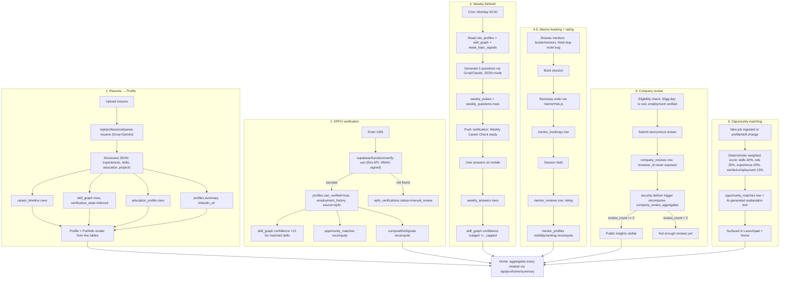

# Professional Path — Production Architecture

Status: architecture blueprint, grounded in a full trace of the existing codebase (not greenfield). Every recommendation below is marked REAL (already in production), EXTEND (real system, needs more), CONSOLIDATE (two competing implementations exist, pick one), or NEW (nothing exists, must be built). This document does not repeat anything already correctly built — it tells an engineering team exactly what to reuse, what to fix, and what to add.

---

## 0. Data reality audit (read this before writing any code)

The Professional Path is **not a blank slate**. A full trace of `frontend/src/pages`, `backend/server/routes`, `backend/server/lib`, and `supabase/functions` found the following. Treat this table as ground truth over any assumption in a spec.

| Capability | Status | Where |
|---|---|---|
| Resume parsing (PDF/LinkedIn, AI-structured) | **REAL** — multi-stage Groq→Gemini pipeline, production-hardened | `backend/server/routes/resume.js` (`/api/professional/parse-resume`, `/api/extract-pdf`, `/api/extract-linkedin`) |
| Career timeline CRUD + approval workflow | **REAL** | `backend/server/routes/careerTimeline.js` → `career_timeline` table |
| Vault (documents/proof storage) | **REAL** | same file → `vault_documents` table + Storage bucket `vault-documents` |
| Skill graph + confidence scoring | **REAL** | `backend/server/routes/skillGraph.js` → `skill_graph`/`skills`/`user_skills` tables (`confidence_score`, `elo_value`, `verification_state`, `proof_artifacts`) |
| Forge (skill-repair tasks, AI-graded) | **REAL backend, orphaned frontend** — `Forge.jsx` page is unrelated | `backend/server/routes/forge.js` → `forge_items` table |
| Mentor Hub (profiles, bookings, Razorpay payouts) | **REAL backend, no booking UI** | `backend/server/routes/mentorHub.js` → `mentor_profiles`, `mentor_bookings`, `mentor_payouts` |
| Pulse (feed) / Nexus (connections/follows) | **REAL, mature** | `backend/server/routes/pulseNexus.js` → `pulse_posts`, `post_interactions`, `connections`, `follows`, `notifications` |
| Career intelligence reports (market gap, layoff mode, etc.) | **REAL** | `backend/server/routes/orbitPlans.js` → `career_reports` table, 8 templates, Claude/Groq |
| Orbit subscriptions/payments | **REAL** | same file → `user_subscriptions`, `coupons`, Razorpay |
| ELO / career-health scoring formula | **REAL, deterministic** | `professionalProfile.js`'s `computeEloSignals()` |
| EPFO/UAN verification | **TWO IMPLEMENTATIONS — must consolidate** | (a) real: `supabase/functions/verify-uan` (Eko Employee Details API, HMAC-signed, writes `profiles.uan_*` + `employment_history`), called only from `Orbit.jsx`. (b) stub: `professionalProfile.js` `/api/pro/epfo/submit`+`/status`, writes `epfo_verifications` with a `setImmediate` fake-async block and no real external call, is what `epfoApi`/`CareerTimeline.jsx` actually use. |
| Career timeline UI | **TWO IMPLEMENTATIONS — must consolidate** | (a) `Orbit.jsx`'s inline editor on the `profiles.experiences` JSON blob. (b) `CareerTimeline.jsx` component (used only in `Aura.jsx`) hitting the real `career_timeline` table. |
| Vault UI | **TWO IMPLEMENTATIONS — must consolidate** | Same split as above (`Orbit.jsx` inline vs. `VaultManager.jsx` in `Aura.jsx`). |
| `/pulse/mentors` route | **DUPLICATE DEFINITION** | `pulseNexus.js` defines this route twice; the second silently shadows the first and queries different column names — a live bug, fix before building on top of it. |
| Weekly skill refresh / recurring quiz engine | **ABSENT** | No table, no cron, no route. AI-interview engine (`aiInterview.js`, real) is the closest reusable building block. |
| Company reviews | **ABSENT** | Zero schema, zero route. Fully greenfield. |
| Opportunity matching (beyond raw listings) | **STUB** | `jobs.js`'s `mapJob()` sets `match_score: null` explicitly, "populated by AI match if enabled" — never implemented. |

**Consequence for this document:** Home, Orbit, Forge, Pulse, Connect are largely **consolidation + extension** work, not new builds. Only the Weekly Refresh Engine, Company Reviews, and real Opportunity Matching are genuinely new systems. Launchpad and Profile need moderate new work (mentor booking UI, unified profile aggregation).

---

## 1. Module architecture (target state)

```
Professional Path
├── Home            — decision center (reads from every module below, writes nothing new)
├── Orbit           — career state engine (career_timeline + employment_history + epf_records + career_reports)
├── Forge           — skill maintenance (skill_graph/skills + forge_items + NEW weekly_pulses)
├── Launchpad       — opportunities (jobs + NEW opportunity_matches + mentor_bookings as "advisory")
├── Pulse           — awareness (pulse_posts + market-insights, unchanged)
├── Connect         — human layer (mentor_profiles/bookings/payouts + NEW company_reviews)
├── Profile         — persistent identity (aggregates all of the above, read-mostly)
└── Settings        — account/visibility/notification prefs (extends existing profile settings)
```

Each module is a **page + a set of already-real or newly-defined API clients**, not a new microservice. Capabilio is a monolith (single `backend/server.js` Express app, single Supabase Postgres) — this document does not introduce new services, per the existing architecture and the standing instruction to avoid over-engineering.

### 1.1 Frontend route map

| Route (`currentPage`) | Component | Change required |
|---|---|---|
| `professionalHome` | `ProfessionalHome.jsx` | Stop re-deriving ELO/health scores client-side; call `profileApi.get()`'s real `computeEloSignals()` output instead (CONSOLIDATE). Add sections listed in §2. |
| `orbit` | `Orbit.jsx` | Remove the inline timeline/vault editors; render `CareerTimeline.jsx`/`VaultManager.jsx` instead (CONSOLIDATE). Point `VaultTab`'s UAN capture at the real edge function via `epfoApi` wrapper, not a raw `fetch` (CONSOLIDATE, see §5). Keep `LayoffMode` but wire it to `career_reports` (`layoff_mode` template) instead of static copy. |
| `forge` | `Forge.jsx` | Repurpose current page's fields (target role, CTC, break narrative) into a "Profile completeness" sub-tab of Profile instead — that's what they actually are. Build a *new* Forge page on top of the real `forge_items`/`forgeApi` backend plus the new Weekly Pulse engine (§4). |
| `launchpad` | `Launchpad.jsx` | Add referral/consulting/freelance/advisory sections (currently jobs-only). Wire real `opportunity_matches` once built (§6). |
| `pulse` | `Pulse.jsx` | No structural change — already real. |
| `nexus` → rename to Connect in nav | `Nexus.jsx` | Add mentor discovery/booking UI on top of the real `mentorApi` (currently no page consumes it). Add company review submission + insights UI (§7). |
| `aura` | `Aura.jsx` | This becomes canonical **Profile**. Already has the correct `CareerTimeline.jsx`/`VaultManager.jsx`/`SkillGraphView.jsx` wiring — extend, don't replace. |

---

## 2. Home — decision center

Home makes zero new writes; it's a read-aggregation of other modules' real data. Backing query per required signal:

| Signal | Source (real, reused) |
|---|---|
| Weekly skill refresh due | NEW `weekly_pulses` (§4), `status='pending' AND due_at <= now()` |
| New opportunity matches | NEW `opportunity_matches` (§6), `created_at > last_viewed_at` |
| Company review updates | NEW `company_review_aggregates` (§7), for companies in the user's `employment_history` |
| Mentor session requests | REAL `mentor_bookings` where `mentor_id = me AND status='pending'` |
| EPFO verification status | REAL `profiles.uan_verified`/`uan_verified_at` (once consolidated, §5) |
| Career health signals | REAL `computeEloSignals()` output from `professionalProfile.js` |
| Unread messages | REAL `notifications` table, `read_at IS NULL` |
| AI recommendations | REAL `career_reports` (most recent unexpired report) or a lightweight on-demand Groq call — do not persist a new "recommendations" table just for Home |
| Role-based alerts | Derived from `profiles.current_role_title` + `skill_graph.gaps` endpoint (REAL, `/pro/skills/gaps`) |

**API**: one new aggregation endpoint, `GET /api/pro/home/summary`, that fan-outs to the above (server-side Promise.all), so the frontend makes one call instead of eight. This is the only new backend code Home needs.

---

## 3. Orbit — career state engine

Already real: `career_timeline`, `employment_history`, `epf_records`, `career_reports`, `computeEloSignals()`. Required work is consolidation, not construction:

1. Delete `Orbit.jsx`'s inline `TimelineTab` (operates on the `profiles.experiences` JSON blob) and inline vault tab. Replace with `<CareerTimelinePro>`/`<VaultManager>` (the components already used correctly in `Aura.jsx`). This closes the "two timelines disagree" bug class entirely — a single write path means Home, Orbit, and Profile can never show different employment histories for the same user.
2. `career graph` (a visual, not just a list) is new UI only — data already exists in `career_timeline` (ordered by `start_date`) + `path_transitions` (real table, currently unused by any frontend — this is exactly the table for "switches"/"verified transitions"). Query: `SELECT * FROM path_transitions WHERE user_id = $1 ORDER BY transitioned_at`.
3. Compensation history: `career_timeline` already has fields for this per the approval-workflow code (`salary_updates` table also exists, real, currently unused by any route — wire `GET /api/pro/timeline/compensation` to read from it).
4. Promotions: derive from `career_timeline` rows where `event_type = 'promotion'` (already a supported value per the approval-workflow field list) — no new table.

---

## 4. Forge — skill maintenance + Weekly Refresh Engine (NEW)

### 4.1 What's real
`skill_graph` (per-skill `confidence_score`, `elo_value`, `verification_state`, `proof_artifacts`), `forge_items` (repair tasks, AI-graded via Claude/Groq), `skill_recommendations` and `weak_topic_signals` tables (real, currently unused by any route — built for exactly this purpose and never wired up).

### 4.2 What's new: the Weekly Refresh Engine

**Naming (mandatory):** never surface the word "assessment" in this feature. UI copy uses "Weekly Career Check" as the primary name, with "Skill Pulse" / "5-Minute Refresh" as secondary microcopy.

**Schema (3 new tables):**

```sql
create table weekly_pulses (
  id uuid primary key default gen_random_uuid(),
  user_id uuid not null references profiles(id),
  week_of date not null,                        -- Monday of the ISO week
  status text not null default 'pending'
    check (status in ('pending','in_progress','completed','skipped')),
  question_count int not null default 5,
  correct_count int,
  due_at timestamptz not null,
  completed_at timestamptz,
  created_at timestamptz not null default now(),
  unique (user_id, week_of)
);

create table weekly_questions (
  id uuid primary key default gen_random_uuid(),
  pulse_id uuid not null references weekly_pulses(id) on delete cascade,
  skill_id uuid references skills(id),
  question_type text not null
    check (question_type in ('scenario','bug_finding','reasoning','dashboard_interpretation',
                              'architecture_interpretation','operational_decision','work_situation')),
  difficulty int not null default 1,             -- 1-5, scaled from years of experience on that skill
  prompt text not null,
  media_url text,                                -- optional screenshot/log/dashboard/architecture image
  options jsonb not null,                        -- [{id,label}]
  correct_option_id text not null,
  explanation text,
  generated_from text not null,                  -- 'resume_skill' | 'unused_skill' | 'weak_topic_signal' | 'role_profile'
  created_at timestamptz not null default now()
);

create table weekly_answers (
  id uuid primary key default gen_random_uuid(),
  question_id uuid not null references weekly_questions(id) on delete cascade,
  user_id uuid not null references profiles(id),
  selected_option_id text not null,
  is_correct boolean not null,
  response_time_ms int,
  answered_at timestamptz not null default now(),
  unique (question_id, user_id)
);
```

RLS: all three tables, `user_id = auth.uid()` (owner-only reads/writes), matching the pattern already used for `startup_*` tables — no new pattern to invent.

**Generation logic (`POST /api/pro/weekly/generate`, cron-triggered weekly + on-demand):**

1. Read `profiles.current_role_title`, `role_profiles` (real table — role→expected-skills mapping, currently unused, built for exactly this), and `skill_graph` for the user.
2. Compute used-vs-unused: cross-reference `skill_graph.skill_id` against skills referenced in the user's last 90 days of `career_timeline`/`forge_items` activity. Unused skills get priority weighting.
3. Pull any rows in `weak_topic_signals` for this user (real table, unused) — these get highest priority.
4. Assign 5 questions per week: 2 from weak/unused skills, 2 from role-profile-expected skills not yet in `skill_graph`, 1 wildcard from a recently-active skill (keeps it feeling relevant, not just remedial).
5. Difficulty scales with `career_timeline`-derived years of experience in that skill domain (0-2yr → difficulty 1-2, 3-5yr → 2-3, 6+ → 3-5).
6. Question content generation: reuse the existing Groq/Claude prompt infrastructure from `forge.js`'s evaluate function and `skillGraph.js`'s `/gaps` endpoint (same providers, same fallback pattern) — prompt the model with role + skill + difficulty + question_type, require strict JSON output (same JSON-mode pattern already used in `resume.js`), validate against a Zod-equivalent shape before insert. Anti-repetition: exclude any `prompt` text with >0.85 trigram similarity to the user's last 8 weeks of questions (simple Postgres `pg_trgm` check, extension already available in Supabase).

**Completion (`POST /api/pro/weekly/:id/answer`, `POST /api/pro/weekly/:id/complete`):**

- Each answer updates `weekly_answers` and immediately nudges the relevant `skill_graph.confidence_score`: correct answer on a skill → `+3` (capped 100), incorrect → `-2` (floored 0), only ever a **secondary signal** alongside resume/EPFO/certification evidence per §4.3 — never the majority weight.
- On `complete`, recompute `weekly_pulses.correct_count`, mark `completed_at`, and enqueue next week's row.

**Delivery**: push notification (real `notifications` table + existing notification-dispatch pattern from `mentorHub.js`'s booking notifications) fires when `due_at` arrives; mobile-first means the question UI must render inside the existing mobile viewport constraints already used by `Pulse.jsx`/`ProfessionalHome.jsx` (single-column, large tap targets, no desktop-only layout) — this is a frontend layout requirement, not new infrastructure.

### 4.3 Skill confidence model (extends `skill_graph.confidence_score`, does not replace it)

Weighted signal blend, computed server-side (extend `skillGraph.js`, don't add a parallel scoring path):

```
confidence = clamp(0, 100,
    base_from_verification_state          -- existing: user_added=70, inferred=50
  + resume_evidence_bonus        (0-10)   -- existing
  + epfo_verification_bonus      (0-15)   -- NEW: only once EPFO consolidation (§5) is done
  + certification_bonus          (0-10)   -- existing proof_artifacts path
  + weekly_refresh_delta         (±ongoing, small step) -- NEW, from §4.2, capped contribution ±15 total
  + recent_usage_bonus           (0-10)   -- NEW: skill referenced in career_timeline event within 180 days
  + mentor_confirmation_bonus    (0-10)   -- NEW: only if a mentor session's post-session review explicitly endorses the skill
  + manager_confirmation_bonus   (0-10)   -- NEW, optional: manager email confirms via a signed link (no new identity system — reuse the existing invite-link pattern from `careerTimeline.js`'s employer-verification flow if resurrected, else defer)
)
```

Quiz performance is capped at ±15 of the total possible ~100, by design — this directly satisfies "do not overvalue quiz scores alone."

---

## 5. EPFO / UAN verification — consolidation plan (not a new build)

**Decision: keep the real Eko integration (`supabase/functions/verify-uan`), retire the stub (`/api/pro/epfo/submit`+`/status` in `professionalProfile.js`).**

Rationale: the Eko path is a genuine government-data integration already in production; the stub explicitly says "simulate async processing" in its own code comment. Building new architecture on top of the stub would be building on fake data, which the standing product principle forbids.

**Consolidation steps:**
1. Add a thin wrapper in `lib/api.js`'s `epfoApi` that calls the Supabase Edge Function (`supabase.functions.invoke('verify-uan', {...})`) instead of hitting `/api/pro/epfo/submit`. This lets every caller (`CareerTimeline.jsx`, future Orbit/Profile/Home code) go through one client function instead of `Orbit.jsx`'s current raw `fetch`.
2. Deprecate (do not silently delete — mark `// DEPRECATED, use supabase/functions/verify-uan` and 410-Gone the routes after a release cycle) `professionalProfile.js`'s stub endpoints.
3. `epfo_verifications` table: repurpose as an **audit log** of verification attempts (who attempted, when, which UAN, success/failure, confidence returned) rather than the source of truth — the edge function already writes the source-of-truth fields to `profiles.uan_*` and `employment_history`. Add `audit_confidence_score numeric` and `source text default 'eko'` columns if not present; this satisfies the "confidence scoring" and "audit logs" requirements without a new table.
4. Downstream updates on successful verification (all real tables, just need to be triggered from one place instead of two):
   - `profiles.uan_verified = true`, `uan_verified_at = now()`
   - `employment_history` rows replaced where `source = 'epfo'` (already implemented in the edge function)
   - `skill_graph.confidence_score` +15 bonus per §4.3, for skills tagged with the verified employer/role (join via `role_profiles`)
   - `opportunity_matches` (§6) recompute triggered (verified employment is a strong matching signal)
   - Career health (`computeEloSignals()`) recompute, since it already reads `profiles.uan_verified` as one of its inputs (confirm this field is read there; if not, add it — one-line change, not new architecture)

**Manual fallback** (required by spec, currently absent from either path): add `epfo_verifications.status = 'manual_review'` as a valid state, settable when the Eko call returns a not-found/ambiguous result; a lightweight admin-reviewed queue (reuse the existing `org_audit_log`-style admin table pattern, or literally query `epfo_verifications WHERE status='manual_review'` from an internal tool — no new table needed).

---

## 6. Launchpad — opportunities + real matching (NEW matching layer)

Real today: `jobs` table + JSearch live listings. Missing: everything from referrals/consulting/freelance/advisory/internal-mobility onward, and real matching (currently `match_score: null`).

**Schema (1 new table, reuses `jobs` for the listing side):**

```sql
alter table jobs add column if not exists opportunity_type text not null default 'job'
  check (opportunity_type in ('job','referral','consulting','freelance','startup','internal_mobility','contract','advisory'));

create table opportunity_matches (
  id uuid primary key default gen_random_uuid(),
  user_id uuid not null references profiles(id),
  job_id uuid not null references jobs(id),
  match_score numeric not null,                -- 0-100
  match_reasons jsonb not null,                -- [{signal, weight, detail}] — must be explainable, not a black box
  created_at timestamptz not null default now(),
  viewed_at timestamptz,
  unique (user_id, job_id)
);
```

**Matching logic** (`POST /api/pro/opportunities/match`, run on new job ingest + on profile/skill-graph change):
- Signal 1 (40%): skill overlap between `jobs.required_skills`/`essential_skills` and the user's `skill_graph` (weighted by `confidence_score`, not just presence).
- Signal 2 (25%): role/domain match against `profiles.current_role_title`/`role_profiles`.
- Signal 3 (20%): experience-band fit (`jobs.experience_min/max` vs. years derived from `career_timeline`).
- Signal 4 (15%): verified-employment bonus if EPFO-verified and employer/domain overlaps `jobs.company`/`domain`.

This is a deterministic weighted-sum model (same style as `computeEloSignals()`), not an ML model — consistent with "treat AI outputs as probabilistic, never feed AI decisions directly into scoring" from the product principles. No AI call needed for the score itself; AI (Groq, one-line call) is only used to generate the human-readable `match_reasons` explanation text after the deterministic score is computed.

**Referrals/consulting/freelance/advisory**: these are just `jobs.opportunity_type` values with type-specific optional fields (`referral_bonus_amount`, `consulting_day_rate`, `advisory_equity_pct` — add as nullable columns, backward-compatible). Mentor sessions already booked via `mentor_bookings` can be surfaced in Launchpad as "Advisory" read-only cards (no new booking path — reuse `mentorApi`).

---

## 7. Connect — mentorship (extend) + company reviews (NEW)

### 7.1 Mentorship — mostly real, needs a UI + one bug fix

Real: `mentor_profiles`, `mentor_bookings`, `mentor_payouts`, Razorpay order/payout flow, `mentorApi` client. **Missing**: any actual booking-flow page. **Bug to fix first**: `pulseNexus.js` defines `GET /pulse/mentors` twice — the second definition silently wins and queries a different, inconsistent column set (`hourly_rate` vs `hourly_rate_inr`). Fix by deleting the first (dead) definition and confirming the surviving one matches `mentor_profiles`'s actual schema before building a discovery page on top of it.

**Pricing bands** (extend `mentor_profiles`, likely already has a `hourly_rate`-style column per the duplicate-route finding — confirm exact column, then add a `band` derived check constraint):
```sql
alter table mentor_profiles add column if not exists pricing_band text
  generated always as (
    case
      when years_experience < 3 then 'entry'
      when years_experience < 8 then 'mid'
      else 'expert'
    end
  ) stored;
-- Enforce via check constraint, not app-only validation, so it can't be bypassed by a direct API call:
alter table mentor_profiles add constraint pricing_band_caps check (
  (pricing_band = 'entry'  and hourly_rate_inr between 200  and 1000) or
  (pricing_band = 'mid'    and hourly_rate_inr between 500  and 3000) or
  (pricing_band = 'expert' and hourly_rate_inr between 1500 and 8000)
);
```
Moderation: booking creation already goes through the real Razorpay order flow (natural abuse friction — no free-text price injection possible once the check constraint above is added).

Trust badges / visibility ranking: derive from `mentor_bookings` count + average of `mentor_reviews.rating` (real table — confirm it exists; if the review-storage table is actually just a column on `mentor_bookings` rather than a separate table per the initial trace, add a proper `mentor_reviews` table since aggregate ranking needs queryable review rows, not a single JSON blob).

### 7.2 Company reviews (fully NEW, greenfield)

**Schema:**

```sql
create table company_reviews (
  id uuid primary key default gen_random_uuid(),
  reviewer_id uuid not null references profiles(id),   -- never exposed to any read API below aggregate level
  company_id uuid not null references companies(id),
  employment_id uuid references employment_history(id),
  role_title text,
  review_phase text not null check (review_phase in ('30_day','exit')),
  work_culture int not null check (work_culture between 1 and 5),
  learning int not null check (learning between 1 and 5),
  manager_support int not null check (manager_support between 1 and 5),
  work_life_balance int not null check (work_life_balance between 1 and 5),
  role_clarity int not null check (role_clarity between 1 and 5),
  compensation int not null check (compensation between 1 and 5),
  growth int not null check (growth between 1 and 5),
  technology int not null check (technology between 1 and 5),
  career_progression int not null check (career_progression between 1 and 5),
  comment text,
  created_at timestamptz not null default now(),
  unique (reviewer_id, company_id, review_phase)   -- one review per employment phase, enforced at the DB level
);

create table company_review_aggregates (
  company_id uuid primary key references companies(id),
  review_count int not null default 0,
  avg_work_culture numeric, avg_learning numeric, avg_manager_support numeric,
  avg_work_life_balance numeric, avg_role_clarity numeric, avg_compensation numeric,
  avg_growth numeric, avg_technology numeric, avg_career_progression numeric,
  updated_at timestamptz not null default now()
);
```

**Confidentiality architecture (this is the load-bearing part):**
- `company_reviews.reviewer_id` exists **only** for the uniqueness constraint and eligibility checks (30-day/exit gating) — no API route ever returns it, and RLS on this table is `select` **denied entirely** for normal clients; only a `security definer` Postgres function can read individual rows, and that function only ever writes into `company_review_aggregates`, never returns raw rows to the client.
- Public/company-facing reads go **only** against `company_review_aggregates`, and only once `review_count >= 5` (k-anonymity threshold) — below threshold, the API returns "not enough reviews yet," never a partial/identifiable aggregate.
- Aggregation trigger: `AFTER INSERT ON company_reviews` → `security definer` function recomputes the relevant `company_review_aggregates` row. This means the aggregate table is the only thing any API route or RLS policy ever needs to expose.
- Eligibility check before insert: `review_phase='30_day'` requires an `employment_history` row for that company with `start_date <= now() - interval '30 days'`; `review_phase='exit'` requires an `end_date` set. Both require the employment record to be EPFO-verified **or** resume-verified with `verification_state != 'unverified'` — satisfies "verify employment before allowing company reviews" without requiring full EPFO for every reviewer (resume evidence alone should not be sufficient for the exit review if higher trust is wanted — flagged as a product decision, not an engineering one, for the team to confirm: EPFO-only vs. EPFO-or-resume for eligibility).
- Audit log: a separate `review_submission_audit` table (`reviewer_id`, `company_id`, `phase`, `submitted_at`, `ip_hash`) exists for anti-abuse review **but is never joined to `company_reviews` in any read path** — it exists purely so ops can detect a spam pattern (e.g., 50 reviews from one IP) without ever being able to attribute a specific review's content to a specific person through normal query access, since that would require an explicit, logged, manual join two tables can't accidentally leak on their own.

**API surface** (all new): `POST /api/pro/company-reviews` (submit, eligibility-checked server-side), `GET /api/pro/company-reviews/mine` (a user can see their own past submissions, which is fine — it's their own identity, not a leak), `GET /api/pro/companies/:id/insights` (public, aggregate-only, threshold-gated).

---

## 8. Profile — persistent identity layer

Canonical page: `Aura.jsx` (already has the correct real-data wiring for timeline/vault/skills). Required additions, each backed by an already-real or newly-defined table — no invented sections:

| Profile section | Backing (real unless noted) |
|---|---|
| Professional Summary | `profiles.summary` (add column if absent) — auto-generated by the resume-parse pipeline's existing Groq/Gemini structuring step |
| Skills | `skill_graph` |
| Career Timeline | `career_timeline` |
| Experiences | `career_timeline` (event_type filter) |
| Certifications | `skill_graph.proof_artifacts` where `type='certification'`, or a dedicated `certifications` row set if the resume parser already separates these (confirm in `resume.js` output shape) |
| Badges | derive from mentor trust badges (§7.1) + Forge completion streaks — no separate badges table needed unless the team wants badge history, in which case a simple `badges_earned(user_id, badge_key, earned_at)` append-only table |
| Projects | resume-parser's `_isProject` heuristic output (real, in `resume.js`) — persist into a `projects` table if not already; confirm before adding a duplicate |
| Education | `education_profile` (real table, confirmed present in schema, currently likely underused — wire resume parser's education section into it) |
| Achievements | same pattern as Badges — derive, don't fabricate a new freeform "achievements" feed unless a real source exists |
| Domains | `profiles.domain_tags` or derive from `role_profiles` mapping |
| Portfolio | same underlying data as Profile, rendered in a public-facing layout — do not duplicate storage, only the view |
| Linked accounts | `profiles.linkedin_url` etc. (resume-parse/LinkedIn-extract already populate this) |
| Publications / Awards | only if resume parser extracts these (check `resume.js` output schema before assuming a new table is needed) |
| Employment verification | `profiles.uan_verified` + `employment_history.source` (post EPFO consolidation, §5) |
| Mentor status | `mentor_profiles` existence + `pricing_band` |
| Reviews | mentor reviews **given by** this user (not company reviews — those stay anonymous per §7.2, never surfaced on a profile) |
| Skill confidence | `skill_graph.confidence_score`, rendered via existing `SkillGraphView.jsx` |

**Profile vs Portfolio**: same data, two renderers. Portfolio is the public/shareable view (subset of fields per `profiles.visibility` settings, already a real concept per `profileApi.setVisibility`) — no separate portfolio data store.

---

## 9. Permission model (RLS pattern — no new pattern, reuse what's proven)

Every new table in this document follows the exact RLS pattern already proven across `startup_*`, `career_timeline`, `vault_documents`: owner-scoped via `user_id = auth.uid()` (or a subquery through an owning row for tables like `weekly_questions` that hang off `weekly_pulses`), `security invoker` functions, `search_path = public` pinned (per the actual security-advisory fix already applied once this session to `set_updated_at()` — replicate that discipline for any new trigger function). Company review aggregates are the one deliberate exception: reads are public-but-thresholded, writes are `security definer`-only, exactly as detailed in §7.2.

---

## 10. Mermaid — end-to-end flow



---

## 11. Implementation roadmap

Phased so every step ships on real data, mirroring how the Executive Path's sprints were sequenced in this codebase:

1. **Consolidation sprint** (no new tables): unify Orbit's timeline/vault UI onto `CareerTimeline.jsx`/`VaultManager.jsx`; fix the `/pulse/mentors` duplicate-route bug; point `epfoApi` at the real Eko edge function; stop `ProfessionalHome.jsx` from re-deriving its own ELO formula.
2. **Weekly Refresh Engine** (3 new tables, §4.2): generation job, mobile-first question UI, skill-confidence feedback loop.
3. **Company Reviews** (2 new tables + 1 audit table, §7.2): eligibility checks, anonymized aggregation trigger, insights API.
4. **Opportunity Matching** (1 new table, §6): deterministic scorer, Launchpad UI update, opportunity-type expansion on `jobs`.
5. **Mentor booking UI** (0 new tables, real backend already exists): discovery page, booking flow, review submission, ranking display.
6. **Profile/Portfolio unification** (mostly UI, a few nullable columns): wire every section in §8 to its real or newly-defined source.
7. **Home aggregation endpoint** (`/api/pro/home/summary`): last, since it depends on every module above being real.
